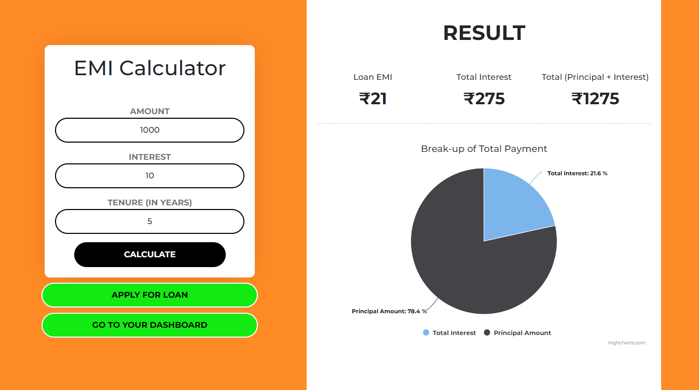
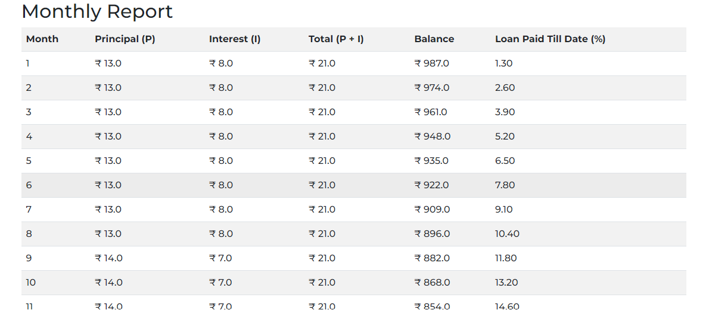

#

# Grip-Invest

A working prototype of emi calculation and loan management.

## Demo

https://grip-invest-frontend.herokuapp.com/

## Screenshots






## Deployment

To deploy backend of this project run

```bash
  cd backend
  npm install
  npm start
```

Change db.config.js file as per your db connection

To deploy frontend of this project run

```bash
  cd frontend
  npm install
  npm start
```

## 🔗 Links

[](https://www.linkedin.com/in/naresh-nishad7/)
[](https://naresh-portfolio.web.app/)
